```mermaid
graph TB
    subgraph "Producer Layer"
        P[Producer Service]
        P_API[API Endpoints]
        P --> P_API
    end

    subgraph "Message Queue Layer - RabbitMQ Cluster"
        RMQ1[RabbitMQ Node 1<br/>Primary]
        RMQ2[RabbitMQ Node 2<br/>Mirror]
        RMQ3[RabbitMQ Node 3<br/>Mirror]
        
        subgraph "Queues"
            WQ[Work Queue<br/>Task Distribution]
            PQ[Priority Queue<br/>Urgent Tasks]
            DLQ[Dead Letter Queue<br/>Failed Tasks]
        end
        
        RMQ1 -.Replication.-> RMQ2
        RMQ2 -.Replication.-> RMQ3
        RMQ1 --> WQ
        RMQ1 --> PQ
        WQ -.Failed Tasks.-> DLQ
        PQ -.Failed Tasks.-> DLQ
    end

    subgraph "Worker Layer - Horizontal Scaling"
        W1[Worker Node 1<br/>Stateless]
        W2[Worker Node 2<br/>Stateless]
        W3[Worker Node 3<br/>Stateless]
        WN[Worker Node N<br/>Auto-scaled]
        
        W1 -.Heartbeat.-> HC[Health Check Service]
        W2 -.Heartbeat.-> HC
        W3 -.Heartbeat.-> HC
        WN -.Heartbeat.-> HC
    end

    subgraph "Database Layer"
        DB_PRIMARY[(SQL Database<br/>Primary/Master)]
        DB_REPLICA[(SQL Database<br/>Replica/Slave)]
        
        DB_PRIMARY -.Replication.-> DB_REPLICA
        
        subgraph "Schema"
            T_TASKS[tasks table]
            T_DATA[scraped_data table]
            T_WORKER[worker_status table]
        end
        
        DB_PRIMARY --> T_TASKS
        DB_PRIMARY --> T_DATA
        DB_PRIMARY --> T_WORKER
    end

    subgraph "Monitoring Stack"
        subgraph "Metrics & Visualization"
            PROM[Prometheus<br/>Metrics Collection]
            GRAF[Grafana<br/>Dashboards]
            ALERT[Alertmanager<br/>Notifications]
            
            PROM --> GRAF
            PROM --> ALERT
        end
        
        subgraph "Logging & Error Tracking"
            ES[Elasticsearch<br/>Log Storage]
            LS[Logstash<br/>Log Aggregation]
            KB[Kibana<br/>Log Visualization]
            SENTRY[Sentry<br/>Error Tracking]
            
            LS --> ES
            ES --> KB
        end
        
        ALERT -.Email/Slack/PagerDuty.-> NOTIF[Notification Channels]
    end

    subgraph "External Services"
        TARGETS[Target Websites<br/>Scraping Targets]
    end

    %% Main Data Flow
    P_API -->|Publish Tasks| RMQ1
    WQ -->|Consume Tasks| W1
    WQ -->|Consume Tasks| W2
    PQ -->|Consume Tasks| W3
    WQ -->|Consume Tasks| WN
    
    W1 -->|Store Data| DB_PRIMARY
    W2 -->|Store Data| DB_PRIMARY
    W3 -->|Store Data| DB_PRIMARY
    WN -->|Store Data| DB_PRIMARY
    
    W1 -->|Scrape| TARGETS
    W2 -->|Scrape| TARGETS
    W3 -->|Scrape| TARGETS
    WN -->|Scrape| TARGETS

    %% Monitoring Integration Points
    P -.Health & Metrics.-> PROM
    RMQ1 -.Health & Metrics.-> PROM
    W1 -.Health & Metrics.-> PROM
    W2 -.Health & Metrics.-> PROM
    W3 -.Health & Metrics.-> PROM
    WN -.Health & Metrics.-> PROM
    DB_PRIMARY -.Health & Metrics.-> PROM
    
    P -.Logs.-> LS
    W1 -.Logs.-> LS
    W2 -.Logs.-> LS
    W3 -.Logs.-> LS
    WN -.Logs.-> LS
    
    W1 -.Errors.-> SENTRY
    W2 -.Errors.-> SENTRY
    W3 -.Errors.-> SENTRY
    WN -.Errors.-> SENTRY
    P -.Errors.-> SENTRY

    %% Failover Connections
    W1 -.Failover.-> RMQ2
    W2 -.Failover.-> RMQ3
    W1 -.Read Replica.-> DB_REPLICA
    W2 -.Read Replica.-> DB_REPLICA

    %% Kubernetes Orchestration
    K8S[Kubernetes/Orchestration<br/>Auto-scaling & Recovery]
    K8S -.Manages.-> W1
    K8S -.Manages.-> W2
    K8S -.Manages.-> W3
    K8S -.Manages.-> WN
    K8S -.Monitors.-> HC

    style P fill:#4A90E2
    style RMQ1 fill:#FF6B6B
    style RMQ2 fill:#FFA07A
    style RMQ3 fill:#FFA07A
    style W1 fill:#48C774
    style W2 fill:#48C774
    style W3 fill:#48C774
    style WN fill:#48C774
    style DB_PRIMARY fill:#9B59B6
    style DB_REPLICA fill:#C39BD3
    style PROM fill:#E67E22
    style GRAF fill:#F39C12
    style ES fill:#16A085
    style KB fill:#1ABC9C
    style SENTRY fill:#E74C3C
    style K8S fill:#3498DB
```

## Architecture Diagram Legend

### Components
- **Blue**: Producer services
- **Red/Orange**: Message queue layer (RabbitMQ cluster)
- **Green**: Worker nodes (horizontally scalable)
- **Purple**: Database layer (with replication)
- **Orange/Yellow**: Monitoring metrics stack
- **Teal/Green**: Logging and error tracking
- **Light Blue**: Orchestration layer

### Connection Types
- **Solid lines (→)**: Primary data flow
- **Dashed lines (-.->)**: Monitoring, health checks, replication, and failover connections

### Key Features Illustrated
1. **Horizontal Scaling**: Multiple worker nodes that can scale dynamically
2. **High Availability**: RabbitMQ clustering and database replication
3. **Failover**: Multiple paths for message consumption and database access
4. **Monitoring**: All components send metrics, logs, and errors to monitoring stack
5. **Dead Letter Queue**: Failed tasks routed for retry or manual intervention
6. **Health Checks**: Workers send heartbeats to health check service
7. **Orchestration**: Kubernetes manages worker lifecycle and auto-scaling