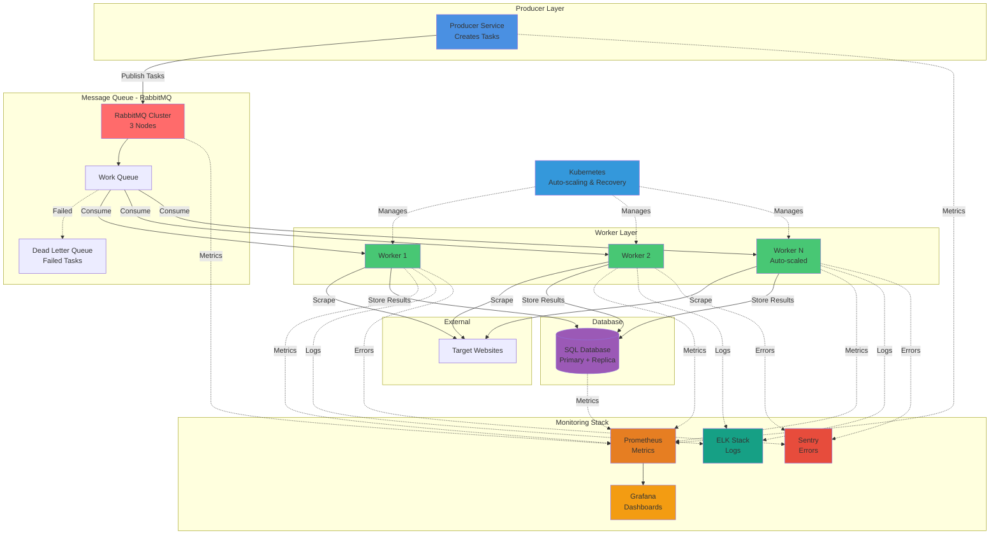

## Architecture Overview

### Core Components
- **Producer**: Generates scraping tasks and publishes to queue
- **RabbitMQ Cluster**: Message broker with 3-node cluster for high availability
- **Worker Nodes**: Stateless containers that consume tasks and scrape websites (horizontally scalable)
- **SQL Database**: Stores results with primary-replica setup
- **Monitoring**: Prometheus/Grafana (metrics), ELK Stack (logs), Sentry (errors)
- **Kubernetes**: Orchestrates worker scaling and recovery

### Key Features
- **Horizontal Scaling**: Add/remove worker nodes based on load
- **High Availability**: RabbitMQ clustering, database replication
- **Dead Letter Queue**: Failed tasks for retry or manual intervention
- **Comprehensive Monitoring**: Metrics, logs, and error tracking from all components
- **Auto-scaling**: Kubernetes manages worker lifecycle based on queue depth